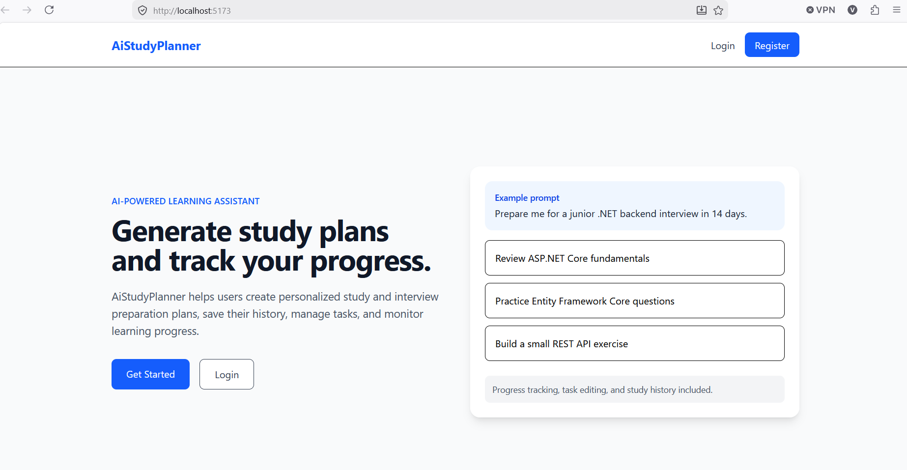
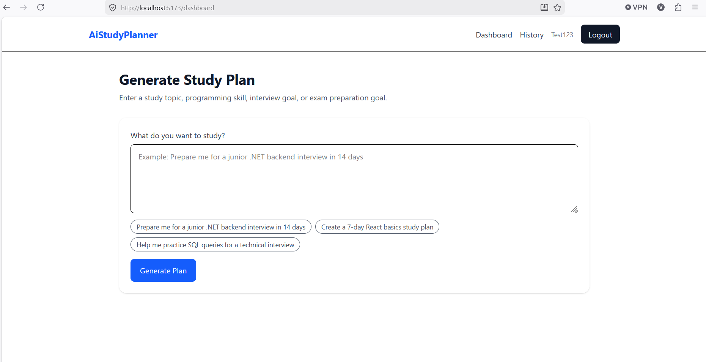
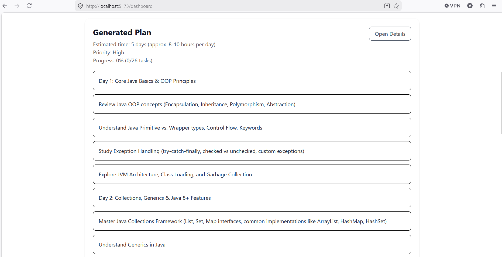
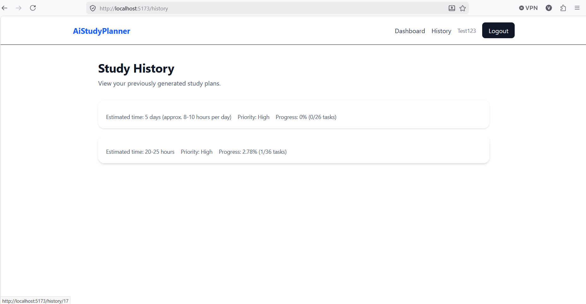
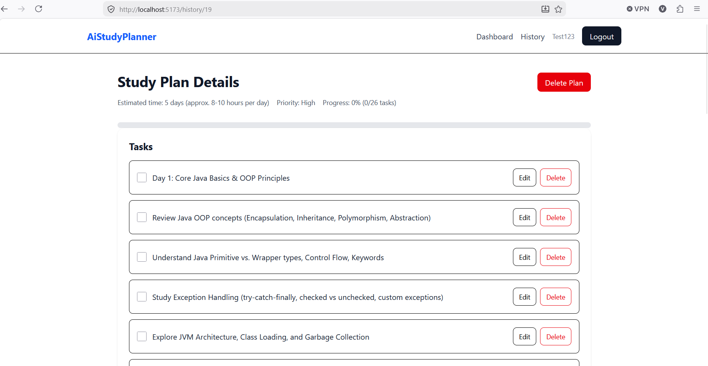

# AiStudyPlanner

AiStudyPlanner is a full-stack AI-powered study planning application that helps users generate personalized study and interview preparation plans, manage tasks, save study history, and track learning progress.

The application is focused on study-related topics such as programming, technical interview preparation, exams, certifications, and career learning goals.

## Features

- User registration and login
- JWT authentication
- Protected React routes
- AI-generated study plans
- Study-topic restriction for focused plan generation
- Mock AI mode for development and testing
- User-specific study history
- View study plan details
- Complete and incomplete tasks
- Edit task titles
- Add custom tasks
- Delete tasks
- Delete full study plans
- Progress tracking based on completed tasks
- PostgreSQL persistence
- Responsive React frontend
- Reusable frontend components
- Loading states and error handling

## Tech Stack

### Backend

- ASP.NET Core
- Clean Architecture
- Entity Framework Core
- PostgreSQL
- JWT Authentication
- REST API
- Gemini API integration
- Swagger
- Request validation

### Frontend

- React
- Vite
- JavaScript
- Tailwind CSS
- Axios
- React Router

## Screenshots

### Landing Page



### Dashboard



### Generated Study Plan



### Study History



### Study Plan Details



## How It Works

1. The user registers and logs in.
2. The backend returns a JWT token after successful login.
3. The frontend stores the token and uses it for protected API requests.
4. The user enters a study or interview preparation goal.
5. The backend validates that the topic is study-related.
6. The backend generates a study plan using Gemini API or mock AI mode.
7. The generated plan is saved to PostgreSQL.
8. The user can view previous study plans, manage tasks, and track progress.

## Project Structure

```text
AiStudyPlanner/
  AiStudyPlanner.API/
  AiStudyPlanner.Application/
  AiStudyPlanner.Domain/
  AiStudyPlanner.Infrastructure/
  aistudyplanner-frontend/
  screenshots/
  README.md
```

### Backend Structure

The backend follows Clean Architecture principles:

- `AiStudyPlanner.API` — Controllers, API configuration, authentication setup, Swagger, request/response contracts
- `AiStudyPlanner.Application` — Business logic, services, interfaces, use case logic
- `AiStudyPlanner.Domain` — Core domain models
- `AiStudyPlanner.Infrastructure` — Database context, repositories, persistence logic

### Frontend Structure

- `api/` — Axios client and API service functions
- `components/` — Reusable UI components
- `context/` — Authentication context
- `pages/` — Main application pages

## Backend Setup

### Prerequisites

- .NET SDK
- PostgreSQL
- Visual Studio or another IDE
- pgAdmin or another PostgreSQL management tool

### Configuration

Create or update `appsettings.Development.json` in the API project.

Example:

```json
{
  "ConnectionStrings": {
    "DefaultConnection": "Host=localhost;Port=5432;Database=AiStudyPlannerDb;Username=your_username;Password=your_password"
  },
  "Jwt": {
    "Key": "your-secret-key",
    "Issuer": "AiStudyPlanner",
    "Audience": "AiStudyPlannerUsers"
  },
  "AiSettings": {
    "UseMockAi": true
  },
  "Gemini": {
    "ApiKey": "your-gemini-api-key",
    "BaseUrl": "your-gemini-api-url"
  }
}
```

### Database

Run database migrations before starting the application.

Using .NET CLI:

```bash
dotnet ef database update
```

Or from Visual Studio Package Manager Console:

```powershell
Update-Database
```

### Run Backend

Start the API project from Visual Studio, or run:

```bash
cd AiStudyPlanner.API
dotnet run
```

Swagger should be available at:

```text
https://localhost:7159/swagger
```

The port may be different depending on your local setup.

## Frontend Setup

Go to the frontend folder:

```bash
cd aistudyplanner-frontend
```

Install dependencies:

```bash
npm install
```

Create a `.env` file in the frontend folder:

```env
VITE_API_BASE_URL=https://localhost:7159/api
```

Make sure the port matches your backend API port.

Start the frontend:

```bash
npm run dev
```

The frontend should run at:

```text
http://localhost:5173
```

## Main API Endpoints

### Auth

```text
POST /api/auth/register
POST /api/auth/login
GET  /api/auth/me
```

### Study Plans

```text
POST   /api/ai/generate
GET    /api/ai/history
GET    /api/ai/history/{id}
DELETE /api/ai/history/{historyId}
```

### Tasks

```text
PATCH  /api/ai/history/{historyId}/tasks/{taskId}/complete
PATCH  /api/ai/history/{historyId}/tasks/{taskId}/incomplete
PATCH  /api/ai/history/{historyId}/tasks/{taskId}/title
POST   /api/ai/history/{historyId}/tasks
DELETE /api/ai/history/{historyId}/tasks/{taskId}
```

## Development Notes

The application supports mock AI mode through configuration:

```json
"AiSettings": {
  "UseMockAi": true
}
```

This allows the application to be developed and tested without making external AI API calls.

When mock AI mode is disabled, the backend uses the Gemini API to generate study plans.

## What I Learned

While building this project, I practiced:

- Building a full-stack application with ASP.NET Core and React
- Structuring a backend using Clean Architecture
- Implementing JWT authentication
- Protecting backend endpoints and frontend routes
- Connecting React to ASP.NET Core APIs using Axios
- Managing user-specific data with PostgreSQL
- Persisting AI-generated study plans
- Handling structured AI responses
- Creating reusable React components
- Implementing task management features
- Building progress tracking based on completed tasks
- Improving frontend UX with validation, loading states, error messages, and responsive design

## Project Status

The core application is complete and includes authentication, AI study plan generation, study history, task management, and progress tracking.

## Future Improvements

- Deployment
- Better AI prompt customization
- Study plan categories
- Deadline reminders
- Dark mode
- More detailed analytics
- Export study plans as PDF
- Email reminders for study tasks

## Author

Vladimir Gogovski

- GitHub: [Gogovski20](https://github.com/Gogovski20)
- LinkedIn: https://www.linkedin.com/in/vladimir-gogovski

