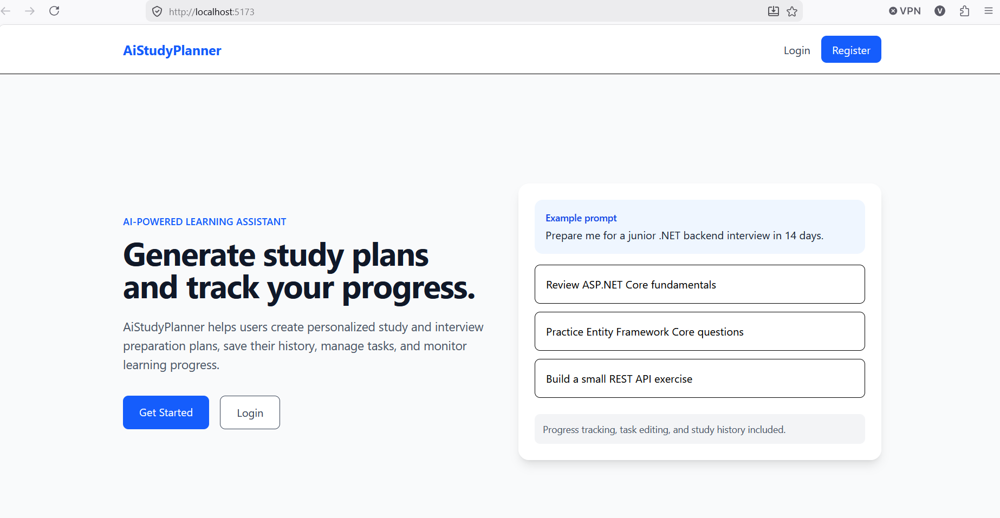
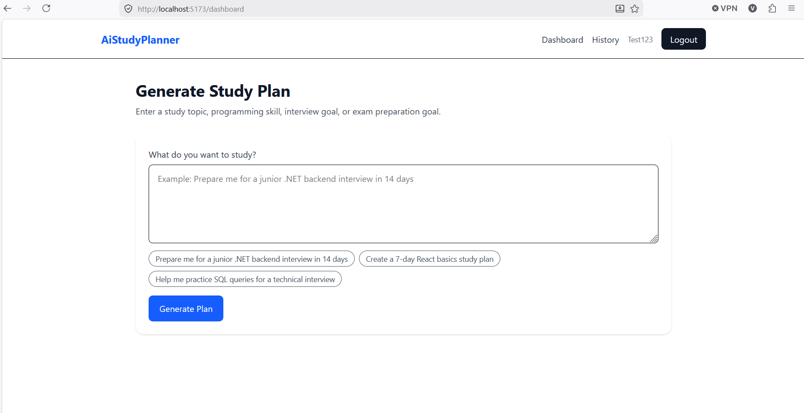
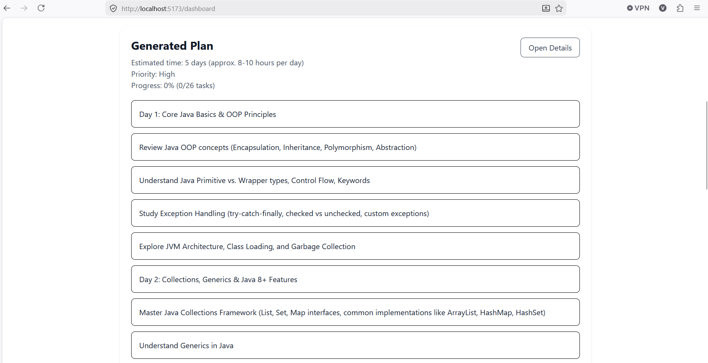
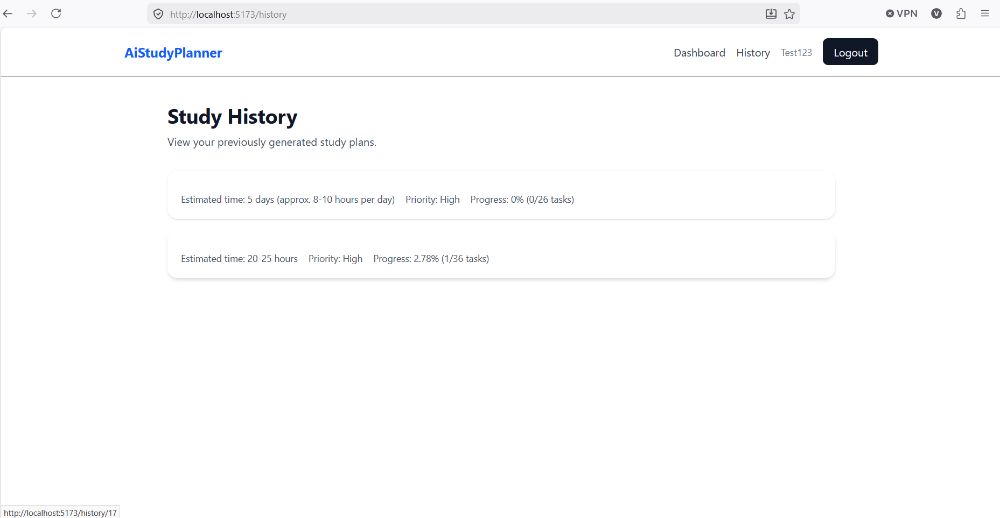
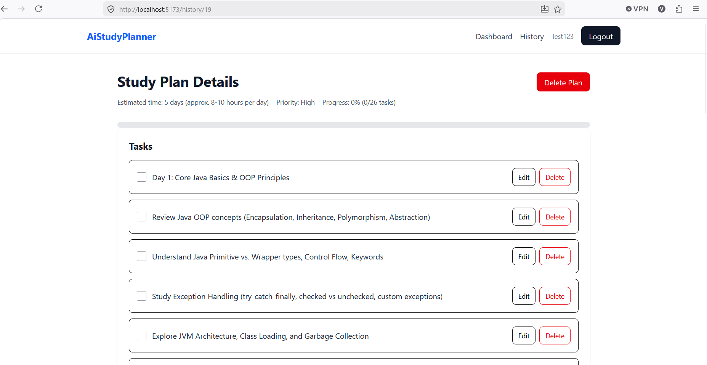

# AiStudyPlanner

AiStudyPlanner is a deployed full-stack AI-powered study planning application that helps users generate personalized study and interview preparation plans, manage tasks, save study history, and track learning progress.

The application is focused on study-related topics such as programming, technical interview preparation, exams, certifications, and career learning goals.

## Live Demo

Live app:

https://ai-study-planner-peach-one.vercel.app

Backend API:

https://aistudyplanner-api.onrender.com

GitHub repository:

https://github.com/Gogovski20/AiStudyPlanner

> Note: The backend is hosted on the Render free plan, so the first request may be slower if the service has been inactive.

## Features

- User registration and login
- JWT authentication
- Protected React routes
- Protected backend API endpoints
- AI-generated study plans
- AI-generated interview preparation plans
- Study-topic restriction for focused plan generation
- Gemini API integration
- Mock AI mode for development and testing
- User-specific study history
- View study plan details
- Complete and incomplete tasks
- Edit task titles
- Add custom tasks
- Delete tasks
- Delete full study plans
- Progress tracking based on completed tasks
- PostgreSQL persistence
- Responsive React frontend
- Reusable frontend components
- Loading states and error handling
- Dockerized backend deployment
- Frontend deployed on Vercel
- Backend deployed on Render
- Production environment variable configuration
- CORS configuration for deployed frontend-backend communication

## Tech Stack

### Backend

- ASP.NET Core
- C#
- Clean Architecture
- Entity Framework Core
- PostgreSQL
- JWT Authentication
- REST API
- Gemini API integration
- Swagger / OpenAPI
- Request validation
- Docker
- Render

### Frontend

- React
- Vite
- JavaScript
- Tailwind CSS
- Axios
- React Router
- Vercel

### Deployment

- Backend: Render
- Frontend: Vercel
- Containerization: Docker
- Environment variables for production configuration
- CORS configuration for frontend-backend communication

## Screenshots

### Landing Page



### Dashboard



### Generated Study Plan



### Study History



### Study Plan Details



## How It Works

1. The user registers and logs in.
2. The backend returns a JWT token after successful login.
3. The frontend stores the token and uses it for protected API requests.
4. The user enters a study or interview preparation goal.
5. The backend validates that the topic is study-related.
6. The backend generates a study plan using Gemini API or mock AI mode.
7. The generated plan is saved to PostgreSQL.
8. The user can view previous study plans, manage tasks, and track progress.

## Project Structure

```text
AiStudyPlanner/
  AiStudyPlanner.API/
  AiStudyPlanner.Application/
  AiStudyPlanner.Domain/
  AiStudyPlanner.Infrastructure/
  aistudyplanner-frontend/
  screenshots/
  Dockerfile
  README.md
```

### Backend Structure

The backend follows Clean Architecture principles:

- `AiStudyPlanner.API` — Controllers, API configuration, authentication setup, Swagger, CORS, request/response contracts
- `AiStudyPlanner.Application` — Business logic, services, interfaces, use case logic
- `AiStudyPlanner.Domain` — Core domain models
- `AiStudyPlanner.Infrastructure` — Database context, repositories, persistence logic, migrations

### Frontend Structure

- `api/` — Axios client and API service functions
- `components/` — Reusable UI components
- `context/` — Authentication context
- `pages/` — Main application pages

## Backend Setup

### Prerequisites

- .NET SDK
- PostgreSQL
- Visual Studio or another IDE
- pgAdmin or another PostgreSQL management tool

### Configuration

Create or update `appsettings.Development.json` in the API project.

Example:

```json
{
  "ConnectionStrings": {
    "DefaultConnection": "Host=localhost;Port=5432;Database=AiStudyPlannerDb;Username=your_username;Password=your_password"
  },
  "Jwt": {
    "Key": "your-secret-key",
    "Issuer": "AiStudyPlanner",
    "Audience": "AiStudyPlannerUsers"
  },
  "AiSettings": {
    "UseMockAi": true
  },
  "Gemini": {
    "ApiKey": "your-gemini-api-key",
    "BaseUrl": "your-gemini-api-url"
  }
}
```

### Database

Run database migrations before starting the application.

Using .NET CLI:

```bash
dotnet ef database update
```

Or from Visual Studio Package Manager Console:

```powershell
Update-Database
```

### Run Backend

Start the API project from Visual Studio, or run:

```bash
cd AiStudyPlanner.API
dotnet run
```

Swagger should be available at:

```text
https://localhost:7159/swagger
```

The port may be different depending on your local setup.

## Frontend Setup

Go to the frontend folder:

```bash
cd aistudyplanner-frontend
```

Install dependencies:

```bash
npm install
```

Create a `.env` file in the frontend folder:

```env
VITE_API_BASE_URL=https://localhost:7159/api
```

Make sure the port matches your backend API port.

Start the frontend:

```bash
npm run dev
```

The frontend should run at:

```text
http://localhost:5173
```

## Production Environment Variables

### Frontend — Vercel

The frontend uses a Vite environment variable to connect to the deployed backend API.

```env
VITE_API_BASE_URL=https://aistudyplanner-api.onrender.com/api
```

Because this is a Vite React app, the environment variable must start with `VITE_`.

### Backend — Render

The backend uses production environment variables for database connection, JWT configuration, Gemini API configuration, and mock AI mode.

Required backend environment variables:

```text
ConnectionStrings__DefaultConnection
Jwt__Key
Jwt__Issuer
Jwt__Audience
Gemini__ApiKey
Gemini__BaseUrl
AiSettings__UseMockAi
```

Example:

```text
AiSettings__UseMockAi=false
```

For local development or testing without external AI calls, mock AI mode can be enabled:

```text
AiSettings__UseMockAi=true
```

## CORS Configuration

The backend is configured to allow requests from the local frontend and the deployed Vercel frontend.

Example:

```csharp
builder.Services.AddCors(options =>
{
    options.AddPolicy("FrontendPolicy", policy =>
    {
        policy.WithOrigins(
                "http://localhost:5173",
                "https://ai-study-planner-peach-one.vercel.app"
              )
              .AllowAnyHeader()
              .AllowAnyMethod();
    });
});
```

The CORS policy is applied before authentication and authorization:

```csharp
app.UseCors("FrontendPolicy");

app.UseAuthentication();
app.UseAuthorization();
```

## Docker

The backend is Dockerized for deployment.

Example Docker workflow:

```bash
docker build -t aistudyplanner-api .
docker run -p 8080:8080 aistudyplanner-api
```

The Docker image is used for backend deployment on Render.

## Deployment

### Backend Deployment

The backend is deployed on Render using Docker.

Production backend:

```text
https://aistudyplanner-api.onrender.com
```

### Frontend Deployment

The frontend is deployed on Vercel.

Production frontend:

```text
https://ai-study-planner-peach-one.vercel.app
```

The deployed frontend communicates with the Render backend through the `VITE_API_BASE_URL` environment variable.

## Main API Endpoints

### Auth

```text
POST /api/auth/register
POST /api/auth/login
GET  /api/auth/me
```

### Study Plans

```text
POST   /api/ai/generate
GET    /api/ai/history
GET    /api/ai/history/{id}
DELETE /api/ai/history/{historyId}
```

### Tasks

```text
PATCH  /api/ai/history/{historyId}/tasks/{taskId}/complete
PATCH  /api/ai/history/{historyId}/tasks/{taskId}/incomplete
PATCH  /api/ai/history/{historyId}/tasks/{taskId}/title
POST   /api/ai/history/{historyId}/tasks
DELETE /api/ai/history/{historyId}/tasks/{taskId}
```

## Development Notes

The application supports mock AI mode through configuration:

```json
"AiSettings": {
  "UseMockAi": true
}
```

This allows the application to be developed and tested without making external AI API calls.

When mock AI mode is disabled, the backend uses the Gemini API to generate study plans.

## Testing the Application

Main flow tested:

```text
Register
Login
Refresh dashboard
Generate study plan
Open plan details
Complete task
Mark task as incomplete
Edit task title
Add custom task
Delete custom task
Open history
Open saved plan from history
Delete full plan
Verify removal from history
Logout
Protected route redirect
```

## What I Learned

While building this project, I practiced:

- Building a full-stack application with ASP.NET Core and React
- Structuring a backend using Clean Architecture
- Implementing JWT authentication
- Protecting backend endpoints and frontend routes
- Connecting React to ASP.NET Core APIs using Axios
- Managing user-specific data with PostgreSQL
- Persisting AI-generated study plans
- Handling structured AI responses
- Creating reusable React components
- Implementing task management features
- Building progress tracking based on completed tasks
- Improving frontend UX with validation, loading states, error messages, and responsive design
- Using environment variables for local and production configuration
- Deploying a Dockerized backend to Render
- Deploying a Vite React frontend to Vercel
- Configuring CORS for production frontend-backend communication

## Project Status

The core application is complete and deployed.

Implemented:

- Authentication
- Protected routes
- AI study plan generation
- Study history
- Task management
- Progress tracking
- PostgreSQL persistence
- Dockerized backend
- Render backend deployment
- Vercel frontend deployment

## Future Improvements

- Better AI prompt customization
- Study plan categories
- Deadline reminders
- Dark mode
- More detailed analytics
- Export study plans as PDF
- Email reminders for study tasks
- Better dashboard statistics
- User profile settings
- Password reset flow

## Author

Vladimir Gogovski

- GitHub: [Gogovski20](https://github.com/Gogovski20)
- LinkedIn: https://www.linkedin.com/in/vladimir-gogovski